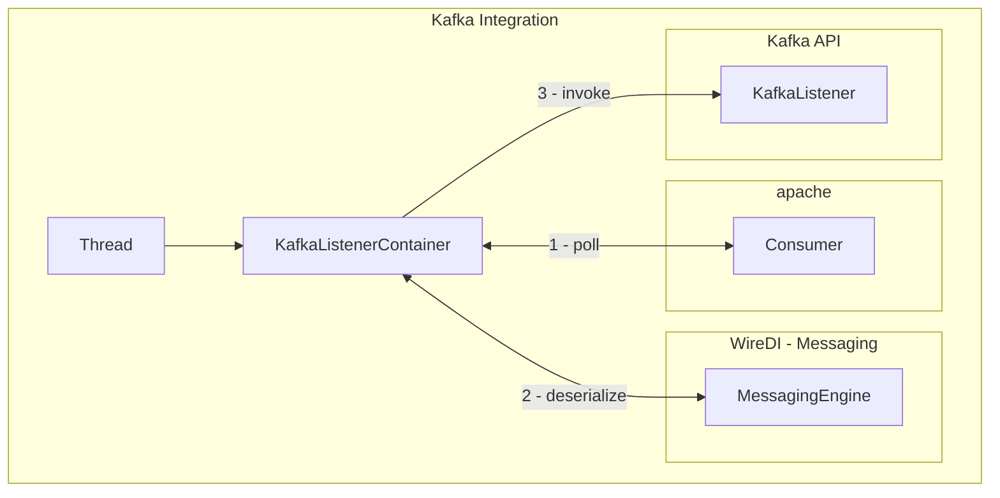

# wiredi-kafka

This integration integrates Kafka into the WireDI landscape.

This is wrapping the [apache-kafka api](https://docs.confluent.io/kafka-clients/java/current/overview.html).

This integration is bypassing the underlying apache kafka (de)serialization and instead incorporates WireDIs messaging api.

## Producer Integration

To send messages, the integration provides the [KafkaPublisher](integration/src/main/java/com/wiredi/kafka/publisher/KafkaPublisher.java).
This class is autoconfigured to be available through dependency injection.
It uses the messaging integration to construct producer records containing byte arrays.

It can be used like this:

```java
import com.wiredi.annotations.Wire;
import com.wiredi.annotations.environment.Resolve;
import com.wiredi.kafka.publisher.KafkaPublisher;

@Wire
public class MyClass {
    private final KafkaPublisher kafkaPublisher;
    private final String topic;
    
    public MyClass(KafkaPublisher kafkaPublisher, @Resolve("${test.topic}") String topic) {
        this.kafkaPublisher = kafkaPublisher;
        this.topic = topic;
    }
    
    public void sendMessage() {
        kafkaPublisher.publish(topic, "test-key", "test-value");
    }
}
```

In general, there is only one KafkaPublisher available for each WireRepository, as serialization is done through the messaging api.

## Consumer Integration

Each [Apache Kafka Consumer](https://kafka.apache.org/37/javadoc/org/apache/kafka/clients/consumer/Consumer.html), which is responsible for polling records, is wrapped in a [KafkaListenerContainer](integration/src/main/java/com/wiredi/kafka/consumer/KafkaListenerContainer.java).
This container is maintaining the consumer and delegating all records to the connected [KafkaListener](api/src/main/java/com/wiredi/kafka/api/KafkaListener.java).

For deserialization the integration is using the messaging api of WireDI.
The underlying Consumer will always return ConsumerRecords with byte arrays.
This way we have full control over all steps in the deserialization and do not need to worry about how to handle errors during deserialization.



When manually connecting against kafka, the [KafkaListenerRegistry](integration/src/main/java/com/wiredi/kafka/KafkaListenerRegistry.java) should be used.
This registry is constructing the aforementioned [KafkaListenerContainer](integration/src/main/java/com/wiredi/kafka/consumer/KafkaListenerContainer.java).

## WireRepository integration

When a WireRepository is started, it will gather all classes that are instances of the [KafkaListener](api/src/main/java/com/wiredi/kafka/api/KafkaListener.java).
All of these will be passed to the [KafkaListenerRegistry](integration/src/main/java/com/wiredi/kafka/KafkaListenerRegistry.java) on startup and started.
Messages are then processed in individual, non-daemon threads, which means that the application will not shut down as long as there are active listeners.

You can change this by providing a custom [KafkaListenerExecutor](integration/src/main/java/com/wiredi/kafka/executor/KafkaListenerExecutor.java) instance to the WireRepository.

To get started with the integration, provide a wire instance that implements [KafkaListener](api/src/main/java/com/wiredi/kafka/api/KafkaListener.java).

```java
import com.wiredi.annotations.Wire;
import com.wiredi.kafka.api.messaging.KafkaConsumerRecordDetails;
import com.wiredi.kafka.api.properties.KafkaConsumerProperties;
import com.wiredi.kafka.consumer.AbstractKafkaListener;
import com.wiredi.kafka.api.topics.Topics;
import com.wiredi.runtime.messaging.Message;
import org.apache.kafka.clients.consumer.ConsumerRecord;
import org.jetbrains.annotations.NotNull;

@Wire
public class ExampleListener extends AbstractKafkaListener {
    
    public ExampleListener(KafkaConsumerProperties properties) {
        super(
                properties,   // We need to provide the consumer properties for the KafkaListenerContainer
                String.class, // The type of the kafka key
                String.class  // The type of the kafka value
        );
    }

    @Override
    public void handle(
            String key, // The key that was sent through kafka. Can be null
            @NotNull Message<String, KafkaConsumerRecordDetails> message // The message, containing the payload/headers and the like.
    ) {
        ConsumerRecord<byte[], byte[]> originalRecord = message.getDetails().record(); // We can use the message details, to retrieve the original ConsumerRecord.
        System.out.println("Received " + key + " => " + message.getBody() + " on " + originalRecord.topic() + "." + originalRecord.partition() + " - " + originalRecord.offset());
    }

    @Override
    public @NotNull Topics topics() {
        // Define the topic we want to listen to.
        // Topics can be either a list of concrete topics, or a pattern.
        // If you return Topics.empty(), you will provoke an error on startup.
        return Topics.of("test");
    }
}
```

If you do not have a main class, create one that looks at least like this:

```java
import com.wiredi.runtime.WireRepository;

public class MyMainClass {
    public static void main(String[] args) {
        WireRepository.open();
    }
}
```

This will create a loaded WireRepository.
Your Listener will be picked up and connected to an apache kafka consumer which is listening to the topic "test."